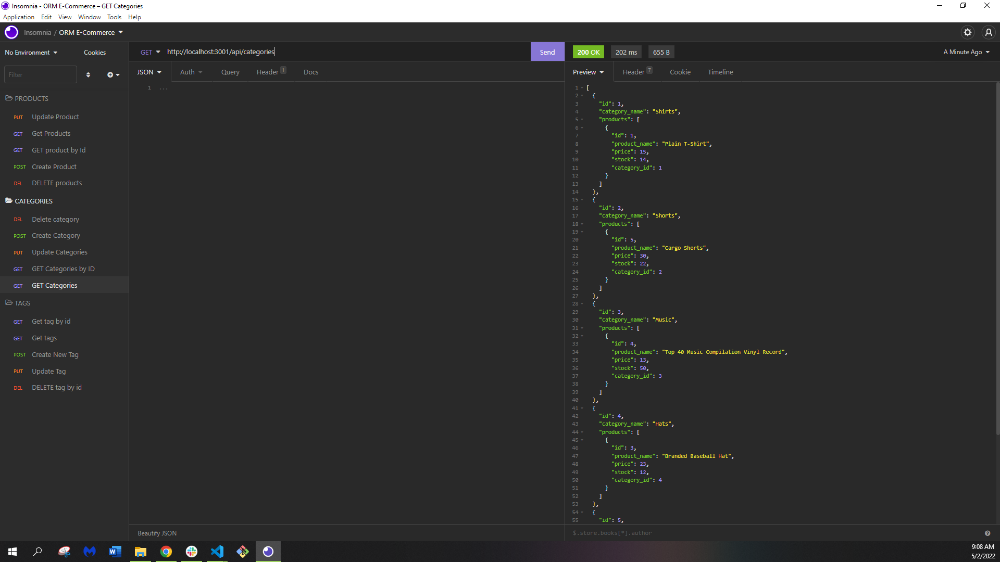

# E-Commerce-Back-End

# Description
This is a back end design of an e-commerce website. 
# Installation
First you will need VS Code, run npm install in your terminal, then install packages such as express.js, sequelize and dotenv package 
# Usage
This project highlights my ability to create the back end of an e-commerce website. It uses express.js APIand Sequelize to interact with a MYSQL database
# Contributors 
Rebekah818
# links
https://github.com/Rebekah818/e-commerse-back-end

https://drive.google.com/file/d/1OigheONzC-vhPgF1ZQNU2gx3ICIPQ9y4/view

https://drive.google.com/file/d/1BEMqHvSLFGmLh-U9L42Ci5yEZyUl6BG6/view

# Screenshots

# Table of Contents
Project Name
 
Description
 
Installation
 
Usage
 
Contributors
 
Links
 
Screenshots